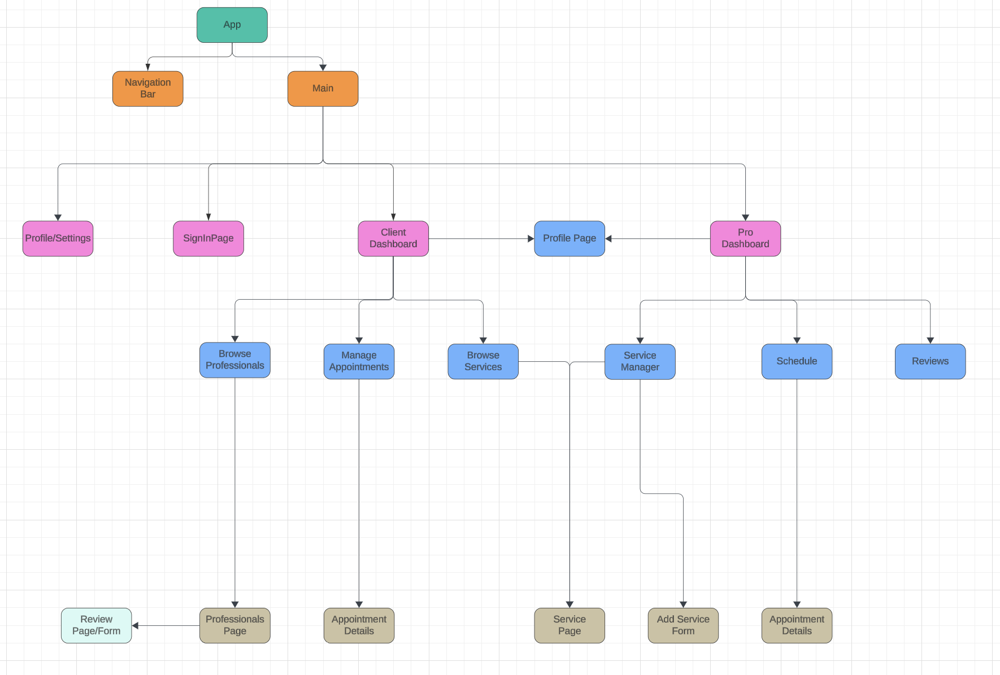
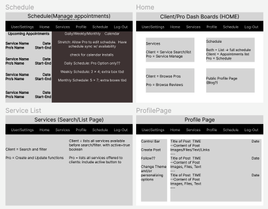

# fitBook (fitConnect?? ProBook??)

### Mission Statement/Description
(Insert App Name) Appointment booking platform designed to effortlessly connect clients with a diverse range of professionals. Streamlining the discovery and booking of professional services. Providing accessibility, efficiency, and trust for clients; while empowring professionals to expand their visibility, manage appointments, and grow their client base. 

### Built With
- **Planning**: LucidChart, Trello, GitHub
- **Frontend**: React.js, Javascript, CSS
- **Backend**: Python/Django/SQL

### Features
- **User Authentication**: Personal User pages and associated data
- **Appointment Scheduling**: Schedule appointments CRUD
- **Ratings and Reviews**: Rate and review appointments and Professionals (Client ratings??); CRUD
- **Search and Filter**: Search for services, professional types, and other additional features.

### Stretch Goals
- **Live Chat**: Virtual meetings and Private messaging system
- **Blog Platform**: Social Media format with personal page being personal/professional blog
- **Share Images**: Images for blog/media posts
- **Share Files**: Send Files through messages for blog/media posts
- **Payment Method**: Secure Data and payment options

## Backend Planning
### Full Entity Relationship Diagram (ERD) for the backend

## Front End Planning
### Component Hierarchy Diagram

### Wireframe

## Contact
- Email
- [LinkedIn](https://www.linkedin.com/in/andrew-h-taggart/)
