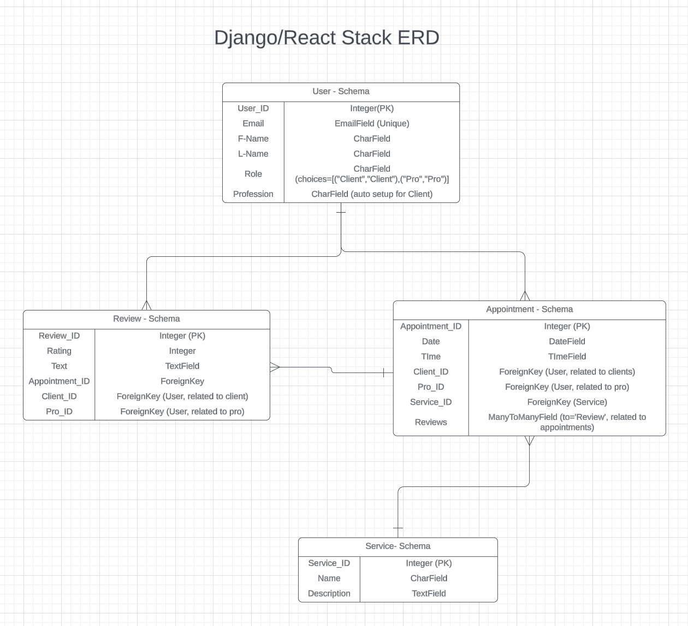

# fit_book (fitConnect??)

## READ.md setup TO-DO
- Component Component Hierarchy Diagram (Lucidchart or other) for the frontend
- Wireframed designs for your Front End
- Trello Board
- Mission statement/description

### Built With

- **Frontend**: React.js, Javascript, CSS
- **Backend**: Python/Django/SQL

### Features
- **User Authentication**: Personal User pages and associated data
- **Appointment Scheduling**: Schedule appointments CRUD
- **Ratings and Reviews**: Rate and review appointments and Professionals (Client ratings??); CRUD
- **Search and Filter**: Search for services, professional types, and other additional features.

### Stretch Goals
- **Live Chat**: Virtual meetings and Private messaging system
- **Blog Platform**: Social Media format with personal page being personal/professional blog
- **Share Images**: Images for blog/media posts
- **Share Files**: Send Files through messages for blog/media posts
- **Payment Method**: Secure Data and payment options

## Full Entity Relationship Diagram (ERD) for the backend

## Contact
- Email
- [LinkedIn](https://www.linkedin.com/in/andrew-h-taggart/)
